# StayNest — Azure Data Factory Movement Pipeline

StayNest currently moves its daily `hotels`, `customers`, and `bookings` CSV files into the data
lake manually. This repo contains a single Azure Data Factory (ADF) pipeline that automates that
move — copying files from a `raw` landing zone into a `bronze` folder — and then verifies the
move actually worked by comparing folder metadata from before and after the copy. ADF is used
here purely as an **orchestrator**: it connects to storage, moves bytes, and checks its own work.
It does no heavy transformation — that work would be handed off to compute like Databricks or
SQL.

## What's in this repo

| Folder | Contents |
|---|---|
| `linkedService/` | ADF linked service definitions (committed automatically via Git integration) |
| `dataset/` | ADF dataset definitions |
| `pipeline/` | ADF pipeline definitions |
| `screenshots/` | Evidence of the build and a successful run (see below) |

> Linked service credentials are never stored in this JSON — ADF keeps the account key in the
> Data Factory service (or in Key Vault) and only writes a reference into the committed file, so
> nothing secret is checked in.

## Linked service

| Name | Type | Target | Auth | Status |
|---|---|---|---|---|
| `LS_Gen2` | Azure Data Lake Storage Gen2 | `staynest` storage account | Account key | Connection tested successfully |

`raw` and `bronze` are two folders inside the same storage account and the same container
(`staynest`).

## Datasets

| Dataset | Points to | Header row | Used by |
|---|---|---|---|
| `ds_source_hotels` | `staynest/raw/hotels.csv` | Yes | Copy activity *Move Hotels file* |
| `ds_source_customers` | `staynest/raw/customers.csv` | Yes | Copy activity *Move Customers file* |
| `ds_source_bookings` | `staynest/raw/bookings.csv` | Yes | Copy activity *Move Bookings file*, and the bonus file-level Get Metadata check |
| `ds_sink` | `staynest/bronze/` (no file name) | Yes | Sink for all three Copy activities, and *Get Metadata of Bronze Folder* — the "after" snapshot|
| `ds_raw_folder` | `staynest/raw/` (no file name) | Yes | *Get Metadata of Raw Folder* — the "before" snapshot |

The assignment only required one source dataset (`ds_source` → `hotels.csv`) and one sink
dataset (`ds_sink` → `bronze`). This build goes further: a dedicated source dataset per file so
all three StayNest files move, plus a matching folder-level dataset on each side of the copy so
the pipeline can compare `raw` and `bronze` before trusting the result.

## Pipeline — `Move`

One pipeline, seven activities, wired so the verification step only ever runs once the copy is
actually finished:

| # | Activity | Type | Runs when | What it does |
|---|---|---|---|---|
| 1 | Get Metadata of Raw Folder | Get Metadata | Pipeline start | Lists `childItems` in `raw/` via `ds_raw_folder` — the "before" file count |
| 2 | Move Hotels file | Copy data | On success of #1 | `ds_source_hotels` → `ds_sink` |
| 3 | Move Customers file | Copy data | On success of #1, in parallel with #2 | `ds_source_customers` → `ds_sink` |
| 4 | Move Bookings file | Copy data | On success of **both** #2 and #3 | `ds_source_bookings` → `ds_sink` |
| 5 | Get Metadata of Bronze Folder | Get Metadata | On success of #4 | Lists `childItems` in `bronze/` via `ds_sink` — the "after" file count |
| 6 | Verify Raw and Bronze files count | If Condition | On success of #5 | Compares the length of the two `childItems` arrays from #1 and #5 |
| 7 | Counts Match / Counts Mismatch | Set Variable | True/False branch of #6 | Writes a `status` variable recording the outcome |

**Why Bookings waits on both Hotels and Customers:** `bookings.csv` carries `customer_id` and
`hotel_id` as reference keys, so it's moved last, on success of *both* upstream copies rather
than either one. This is enforced by connecting two **On Success** arrows into *Move Bookings
file* — ADF treats multiple incoming dependencies as an AND, so it won't fire until both parents
have succeeded. Worth being precise about what this does and doesn't guarantee: Copy activity has
no foreign-key awareness, so this ordering is an operational safeguard against publishing
`bookings.csv` before the tables it references exist in `bronze` — it is not a referential-
integrity check enforced by ADF itself.

**Why verify at all:** a green Copy activity only means "ADF didn't error." Bracketing the copy
with a Get Metadata call on each side and comparing counts is a cheap way to catch a partial or
silently-skipped copy that would otherwise still show green. The comparison itself happens in the
If Condition's expression, referencing both Get Metadata outputs directly — no intermediate
storage needed:

```
@equals(
  length(activity('Get Metadata of Raw Folder').output.childItems),
  length(activity('Get Metadata of Bronze Folder').output.childItems)
)
```

**Reading the Set Variable branches in Monitor:** both branches succeed by design — a mismatch is
*data* the pipeline detected, not a pipeline *error*. So a green check next to **Counts Mismatch**
in the run history doesn't mean anything went wrong with the pipeline — it means the pipeline
correctly caught a count discrepancy between `raw` and `bronze`, and is reporting it via the
`status` variable rather than crashing. Conversely, **Counts Match** showing as the succeeded
branch is what confirms a clean run. In other words: which of the two Set Variable activities
shows green tells you the verification result; the pipeline's own overall status tells you
whether it ran at all. (A stricter alternative would put a **Fail** activity on the false branch
instead, turning a mismatch into an actual pipeline failure — this build favors Set Variable so
the run always completes and the outcome is inspectable afterward.)

## How to run it

1. Open the Data Factory in **Azure Data Factory Studio**.
2. Open the `Move` pipeline and click **Debug**.
3. Watch all seven activities turn green, in order: the two Get Metadata calls bracket the three
   Copy activities, and the If Condition plus its Set Variable branch run last.
4. Confirm `hotels.csv`, `customers.csv`, and `bookings.csv` are all present in `bronze`.
5. In the Debug pane, open **Counts Match** (or **Counts Mismatch**, whichever ran) and check its
   **Input** tab — the `status` variable value states the verification outcome directly.

## Evidence

### Object model — linked service and datasets

| | |
|---|---|
| `raw` and `bronze` folders in the `staynest` storage account | 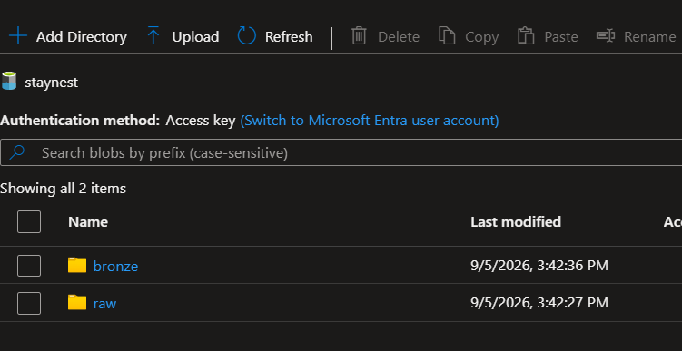 |
| `LS_Gen2` linked service with a successful connection test | 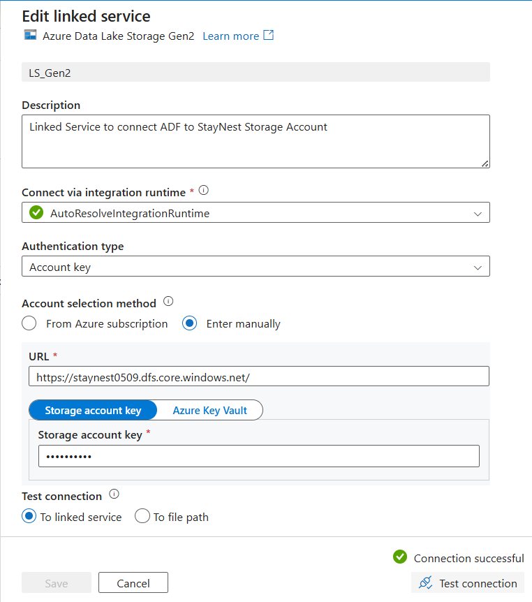 |
| `ds_source_hotels` pointing at `raw/hotels.csv`, header row on | 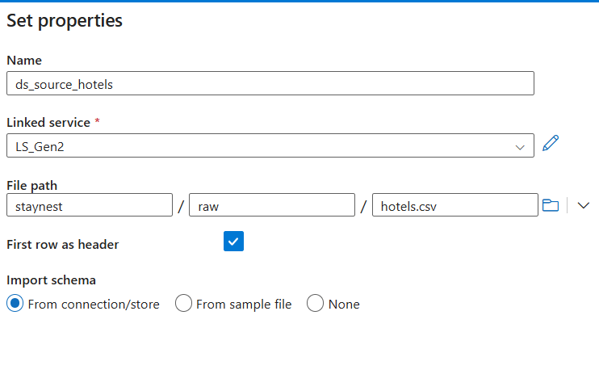 |
| `ds_source_hotels` connection tab, connection successful | 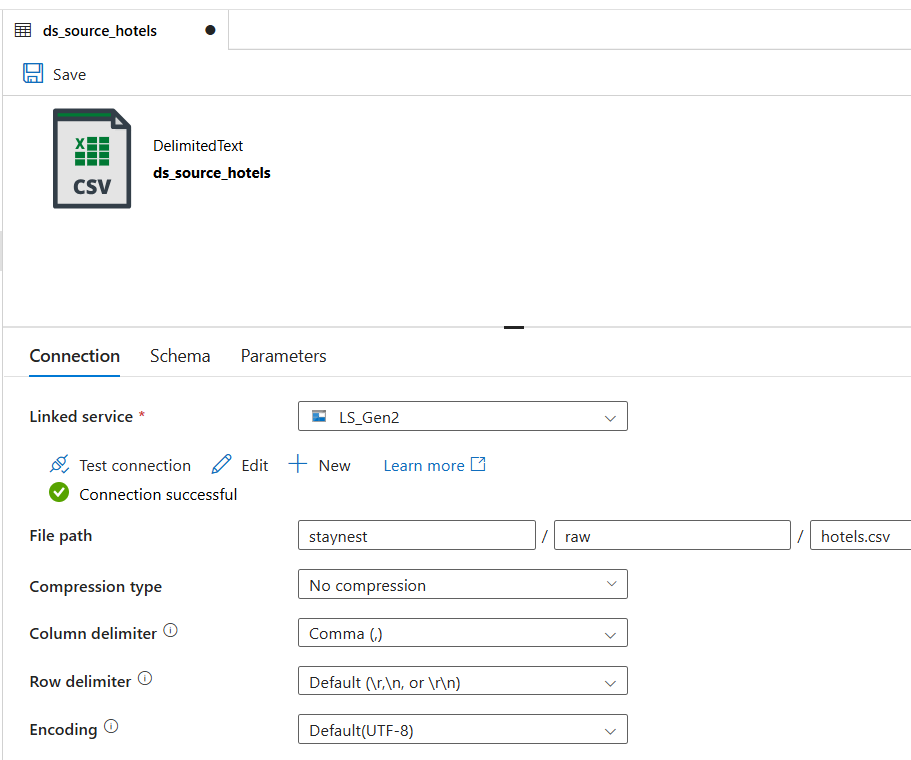 |
| `ds_sink` pointing at the `bronze` folder, no file name set | 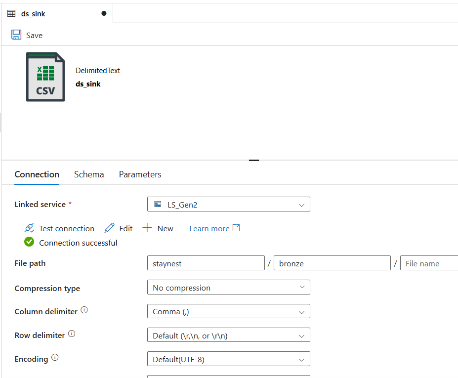 |
| Dataset list at an earlier stage of the build, before `ds_bronze_folder` was added | 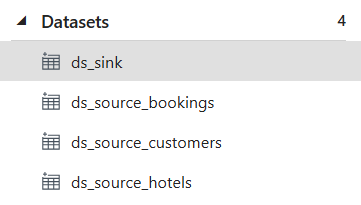 |

### Data movement — building and testing the Copy activities

| | |
|---|---|
| Copy activity source tab set to `ds_source_hotels` | 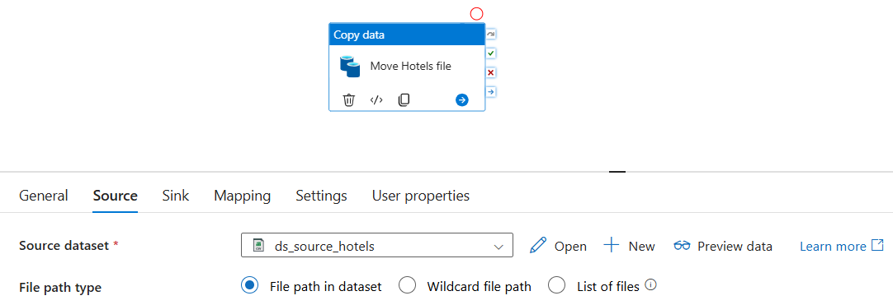 |
| Copy activity sink tab set to `ds_sink` | 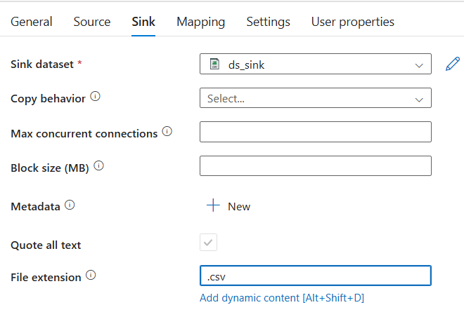 |
| `bronze` folder empty before the first Debug run | 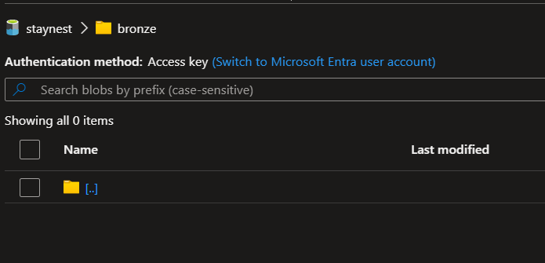 |
| Monitor/Debug output — *Move Hotels file* succeeded | 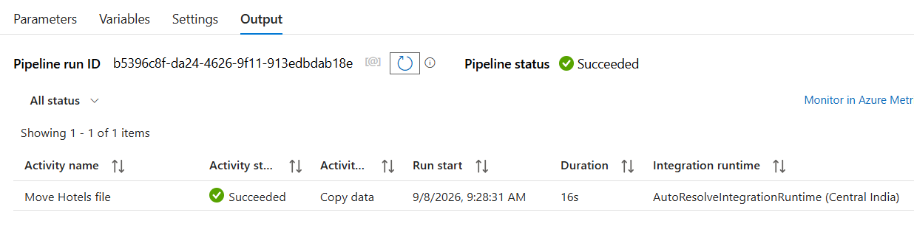 |
| `hotels.csv` now present in `bronze` | 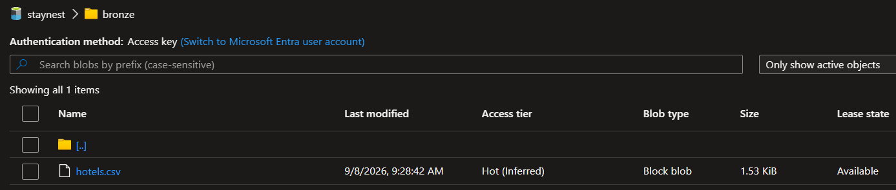 |
| Copy activity run details — 1 file read, 1 file written, succeeded | 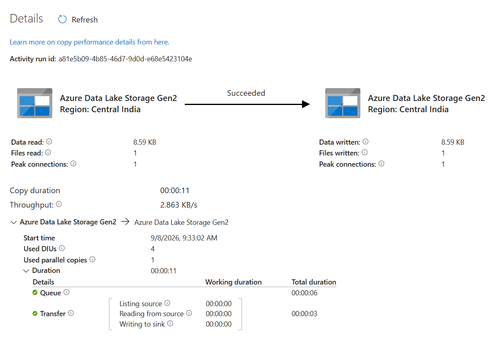 |
| Early build: three Copy activities on the canvas, before the verification layer was added | 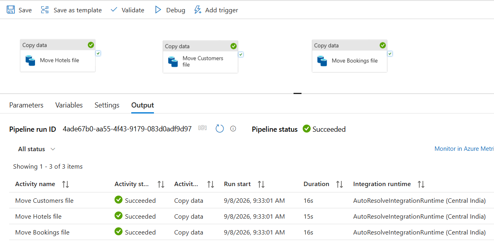 |
| `bronze` folder with all three files after that run | 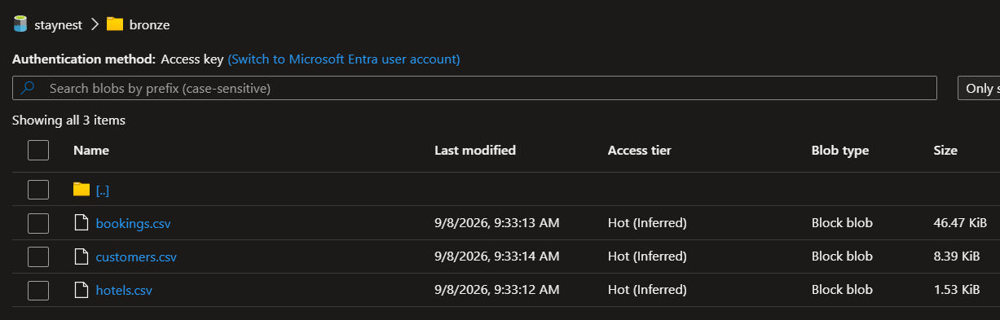 |

### Using activities — Get Metadata

| | |
|---|---|
| `ds_raw_folder` dataset, connection successful | 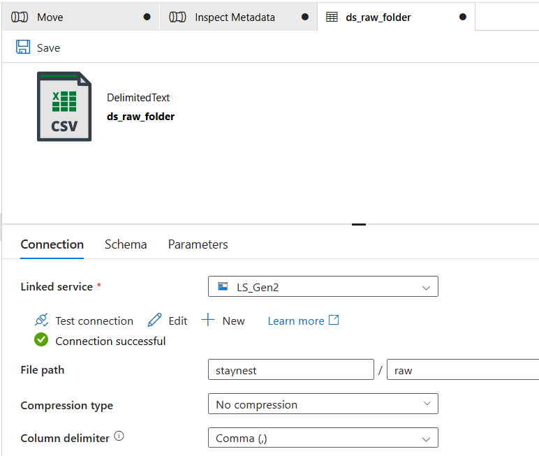 |
| Get Metadata activity settings — `ds_raw_folder`, field list = Child items | 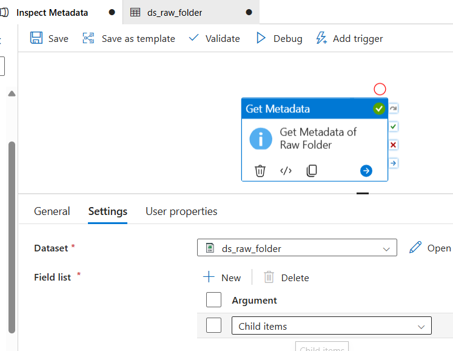 |
| Get Metadata Input JSON — dataset reference and field list | 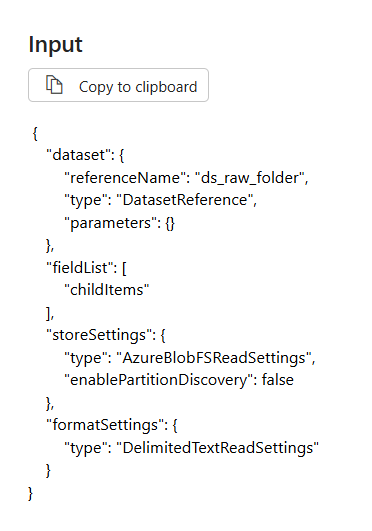 |
| Get Metadata Output JSON — `childItems`: `bookings.csv`, `customers.csv`, `hotels.csv` | 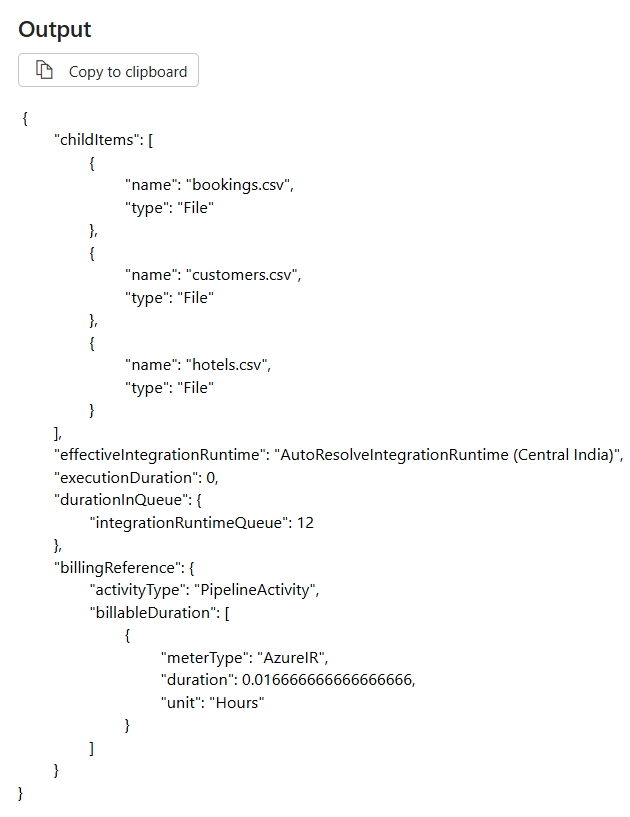 |

**What the output showed:** the `childItems` array listed all three raw files by name and type
(`File`), confirming Get Metadata can enumerate a folder's contents without any file names being
hard-coded — exactly what a metadata-driven loop would iterate over, and exactly the value this
build later compares against `bronze`'s own `childItems` count.

### Bonus exploration — file-level metadata

Pointing Get Metadata at a **file** dataset (`ds_source_bookings`) instead of a folder dataset
unlocks a different set of fields — `itemName`, `itemType`, `columnCount`, `structure`, and
`size` — which describe the file itself rather than a folder's contents.

| | |
|---|---|
| Field list for a file-level Get Metadata call | 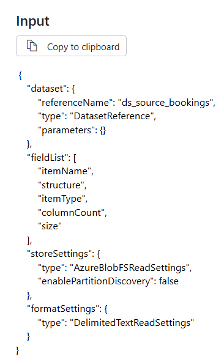 |
| Output showing `bookings.csv`'s column structure and column count (8) | 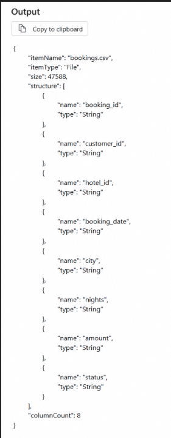 |

### Verification — comparing `raw` and `bronze` before and after the copy

| | |
|---|---|
| Full `Move` pipeline canvas: Get Metadata (raw) → parallel Copy Hotels / Copy Customers → Copy Bookings → Get Metadata (bronze) → If Condition → Set Variable | 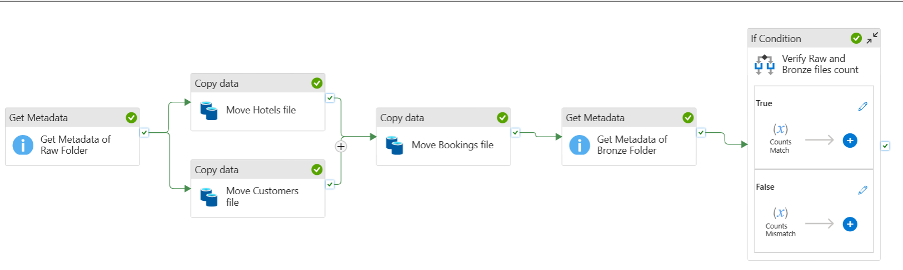 |
| Monitor Output tab — all seven activities succeeded in one Debug run | 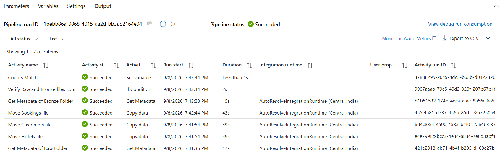 |
| **Counts Match** activity Input — `status` set to `"Success : File Counts Match"` | 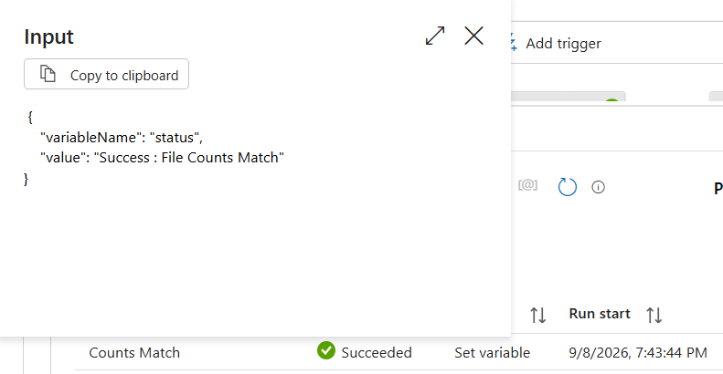 |

**What the run timestamps confirm** — not just that the activities are visually wired together on
the canvas, but that the dependencies were actually enforced at run time:

| Activity | Run start | Duration |
|---|---|---|
| Get Metadata of Raw Folder | 7:41:36 PM | 17s |
| Move Hotels file | 7:41:54 PM | 49s |
| Move Customers file | 7:41:54 PM | 49s |
| Move Bookings file | 7:42:44 PM | 43s |
| Get Metadata of Bronze Folder | 7:43:28 PM | 15s |
| Verify Raw and Bronze files count | 7:43:44 PM | 2s |
| Counts Match | 7:43:44 PM | <1s |

*Move Hotels file* and *Move Customers file* share the exact same start time — they only depend
on *Get Metadata of Raw Folder*, which had already finished (7:41:36 + 17s = 7:41:53), so both
fired together a second later. *Move Bookings file* doesn't start until 7:42:44 — right around
when the slower of the two parallel copies (7:41:54 + 49s = 7:42:43) actually finished, not when
the faster one did. That gap is the AND-dependency working: bookings genuinely waited for both
hotels and customers, it wasn't just drawn that way on the canvas. The same pattern holds for
*Get Metadata of Bronze Folder* starting right after *Move Bookings file* ends, and the If
Condition and *Counts Match* firing back-to-back once the bronze count came back.

In this run, **Counts Match** is the branch that shows Succeeded, and its Input confirms
`status` was set to `"Success : File Counts Match"` — meaning the raw and bronze `childItems`
counts were equal, and the copy is verified, not just assumed, to have moved everything.

## Why parameterize instead of hard-coding?

This build's `Move` pipeline hard-codes one dataset and one Copy activity per file — fine for
three known files, but it doesn't scale: a fourth StayNest file would mean editing the pipeline
again. A parameterized dataset (`fileName` as a parameter, resolved with dynamic content like
`@item().name`) turns "one dataset per file" into "one dataset, reused for every file," and lets
a single Copy activity inside a `ForEach` move any number of files without the pipeline itself
changing. Data Factory stays a thin orchestration layer either way — the difference is whether
new files require a pipeline edit or just show up in the folder.

## Optional stretch — not implemented

The metadata-driven pattern (a parameterized dataset, Get Metadata → `ForEach` → Copy with
`@item().name` as the file name) was not built in this pass. *Get Metadata of Raw Folder* already
produces the `childItems` list that a `ForEach` would loop over, so the remaining work is wiring
that output into a `ForEach` activity and parameterizing `ds_source` accordingly.

## Notes

- No storage account key or connection string is committed anywhere in this repo. ADF's Git
  export keeps the linked service secret out of `linkedService/LS_Gen2.json`.
- Region used throughout: Central India.
